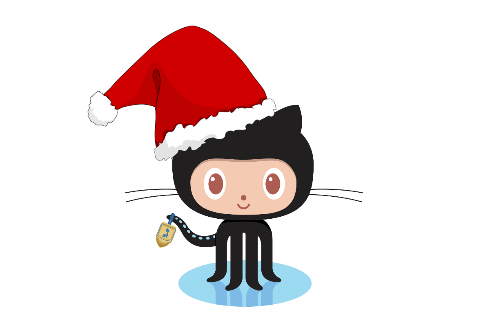

my first change
# Commitmas 2: A Month of Merriment
 We're back for 2015!

#### Table of Contents

1. [Overview](#overview)
2. [The Challenge](#the-challenge)
3. [Commit to Your Skill Level](#commit-to-your-skill-level)
    * [Beginner](#beginner)
    * [Intermediate](#intermediate)
    * [Expert](#expert)
4. [Resources](#resources)
5. [Projects](#projects)

## Overview

Tis the holiday season again, where we relax at home, eat loads of good food and spin driedels. This year, **let's keep learning** all the great stuff learned during the [vBrownBag DevOps sessions](http://professionalvmware.com/vbrownbag-devops-series/).

## The Challenge

Push yourself to use GitHub everyday throughout the holiday season so that by 2016 you're ready to share your next project. Here's how:

1. Schedule time in your calendar for gitting in shape **everyday** for 30 days between December 1st - January 1st
2. Choose your skill level: [Beginner](#beginner), [Intermediate](#intermediate), or [Expert](#expert)
3. Follow the directions under your skill level!
4. Fork this repository to show that you're participating!

That's it! If you get stuck or just want to chat with others, be sure to [tweet with the hashtag `#vBrownBag`](https://twitter.com/hashtag/vbrownbag) or on [the Geek Speak Slack Channel](http://geekspeak.heroku.com) in the `#learn-github` channel. We'll be out there to help.

*Note:* The Slack link doesn't always load due to using Heroku free tier. If you want a faster response, ping [Rob on Twitter](https://twitter.com/rnelson0).

We're also recording training daily throughout December. You can register to be notified of #vBrownBag events at https://attendee.gotowebinar.com/register/4522811764229913858.

Recordings are currently available on YouTube in our [Commitmas Playlist](https://www.youtube.com/playlist?list=PL2rC-8e38bUXloBOYChAl0EcbbuVjbE3t) and will be available soon in [iTunes](https://itunes.apple.com/us/podcast/professionalvmware-vbrownbag/id468638808?mt=2)

## vBrownBag Commitmas Schedule
- **Tuesday 12/1** -    [What is Git/GitHub and why should you use it?](challenges/1) With [Matthew Brender](https://twitter.com/mjbrender)
- **Wednesday 12/2** -  [Setting up Windows](challenges/2) with [Jonathan Frappier](https://twitter.com/jfrappier)
- **Thursday 12/3** -   [Setting up OSX](challenges/3) with [Timmy Carr](https://twitter.com/timmycarr)
- **Friday 12/4** -     [Git Basics - Clone, Add, Commit, & Push](challenges/4) with [Anthony Elizondo](https://twitter.com/complex)
- **Monday 12/7** -     [Branching Repositories - Intro, Creating & Checking out branches](challenges/7) with [Mike Marseglia](https://twitter.com/mmars)
- **Tuesday 12/8** -    [Forking Repositories and Pull Requests](challenges/8) with [Matt Oswalt](https://twitter.com/Mierdin)
- **Wednesday 12/9** -  [Merge and Merge Conflicts](challenges/9) with [Apollo Catlin](https://twitter.com/apollocatlin)
- **Thursday 12/10** -  [Wait I screwed something up and need to roll back!](challenges/10) with [Kyle Ruddy](https://twitter.com/kmruddy)
- **Friday 12/11** -    [Rebasing](challenges/11) with [Rob Nelson](https://twitter.com/rnelson0) *at a special time, 3PM Eastern*
- **Monday 12/14** -    [The art of the ignore: Using .gitignore](challenges/14) with [Eric Wright](https://twitter.com/discoposse)
- **Tuesday 12/15** -   [Stop using '-m': Writing Good Commit Messages](challenges/15) with [Hart Hoover](https://twitter.com/hhoover)
- **Wednesday 12/16** - [Git Security Workflow - Ensure Confidential Data Not Shared](challenges/16) with [Edward Haletky](https://twitter.com/texiwill)
- **Thursday 12/17** -  [Fun git tricks and aliases for bash users](challenges/17) with [Spencer Krum](https://twitter.com/nibalizer)
- **Friday 12/18** -    [How do you get a hoverboard from 2015 to 1955? Cherry-picking](challenges/18) with [Ryan McKern](https://twitter.com/the_mckern)
- **Monday 12/21** -    [Git workflow for supporting network devices](challenges/21) with [Matt Oswalt](https://twitter.com/Mierdin)
- **Tuesday 12/22** -   [Git worktree or flow](challenges/22) with [Igor Galić](https://github.com/hirojin)
- **Wednesday 12/23** - [Building Web Pages for your Project with Jekyll and Github.io](challenges/23) with [Kellan Damm](https://twitter.com/kellandamm)
- **Monday 12/28** -    [GitHub and Slack - Better together](challenges/28) with [Kellan Damm](https://twitter.com/kellandamm)
- **Tuesday 12/29** -   [Contributing to Open Source Projects](challenges/29) with [Jordan Rinke](https://twitter.com/jordanrinke), [Jon Donas](https://twitter.com/JonDonas), [Dylan Ermet](https://twitter.com/@ReDermet), [Jadon Bennett](https://twitter.com/@jsjben), and [Tanner Kerr](https://twitter.com/TannerMKerr)
- **Wednesday 12/30** - [Bringing it all Together - Intro to Go](challenges/30) with [Anthony Chow](https://twitter.com/vCloudernBeer)

# Commit to Your Skill Level
We all have different level of expertise when it comes to GitHub. Here are a few options based on your comfort level. Remember: **focus on learning how git works** and let the other topics follow.

##Beginner

*You're a beginner if:* You're new enough to git that just the act of using it daily will be a lot of learning.

**Setup**:
* Create a GitHub account.
* [Setup Git.](https://help.github.com/articles/set-up-git/)
* Initialize your own new repository with a README.md.
* Clone your repository to your local development system.

**Your challenge**:
* Update the README.md file **every single day** with something you learned that day.
* Add a meaningful comment to your commit. [Learn the right way to comment your commits.](https://github.com/phonegap/phonegap/wiki/Git-Commit-Message-Format)
* Push that commit to your GitHub repository.
* Create additional repositories for scripts that you've created to do your job.
* Learn how to use [`git commit --amend`](http://rnelson0.com/2014/12/26/using-git-amend-for-quick-corrections).
* [Keep your fork in sync with the original repo.](http://rnelson0.com/2014/12/27/updating-your-git-fork-from-the-original-repo/)

**Helpful hints**:
* Remember that the goal of this is to *learn how to use GitHub*, so focus on git, not other code you'd also like to learn.
* Feel free to use the GitHub website, native apps or command line. [Watch this vBB](http://neckbeardinfluence.com/technical-quick-hacking-your-way-into-github/) on GitHub to help you along.
* Markdown is awesomely powerful, so challenge yourself to use some of the more complex syntax. [You can learn it all here.](http://daringfireball.net/projects/markdown/syntax)

##Intermediate

*You're at an intermediate level if:* You're comfortable with the basics of using git, have lurked around on GitHub but never contributed to a project.

**Setup**:
* Fork an interesting repository that you want to contribute to.
* Clone your repository to your local development system.
* Create a new branch to develop in.

**Your challenge**:
* Update the repository's Master branch **every single day** in some way.
* On your new branch, work on a meaningful contribution to your fork of the repository.
* Add meaningful comments to your commits when you commit on both branches.
* Open a Pull Request on the original repository from your new branch by the end of the 30 days of Commitmas!
* Learn how to use [`git rebase`](http://rnelson0.com/2014/12/23/using-git-rebase-to-rewrite-history/).

**Helpful hints**:
* Remember, *documentation is code too (especially when using Markdown)!* Find a project you want to support by improving documentation. Fork it and then make your contributions during this challenge.

##Expert

*You're an expert if:* You've managed multiple contributor repositories before, have more than 5 pull request accepted, and want to join in Commitmas to really push yourself.

**Setup**:
* You've done this a few times, we don't need to tell you how!

**Your challenge**:
* Open a new Pull Request on open source repositories you use **every single day** for the 30 days of Commitmas! Don't forget to help out your beginner and intermediate level friends!

**Helpful hints**:
* You really don't need any, but if you complete this challenge, please tell me ([@mjbrender](http://twitter.com/mjbrender)) and I'll definitely buy you a beer.

## Resources

## Projects

These projects are soliciting pull requests through Commitmas and will be kind to new users without lots of questions along the way. Give back as part of Commitmas by opening Issues & PRs to any of them!

* [Ruby Stargazer by @mjbrender](https://github.com/mjbrender/ruby-stargazer) - A tool to tally unique starrers across GitHub repositories for an organization.
* [Transparent Travel by @mjbrender](https://github.com/mjbrender/transparent-travel) - A markdown-only repository to record where I'm flying and where I'd like to fly next.
* [Anything Puppet by @rnelson0](https://github.com/rnelson0?tab=repositories) - A growing collection of tools written for Puppet
* [Anything Ansible by @mrlesmithjr](https://github.com/mrlesmithjr?tab=repositories) - A growing collection of Ansible-based tools
